# Análise de tarifas horossazonais — ANEEL

Projeto de análise das tarifas homologadas de energia elétrica disponibilizadas pela ANEEL. O notebook analisa a diferenciação horária e sazonal no conjunto nacional e acrescenta um estudo aplicado às distribuidoras do estado de São Paulo, com conversão das tarifas de energia para R$/kWh.

## Conteúdo

- [Notebook da análise](analise_horossazonal_aneel.ipynb)
- [Dados da ANEEL](tarifas-homologadas-distribuidoras-energia-eletrica.csv)
- [Dicionário de dados](Dicionario/)
- [Gráficos gerados](images/)

## Configuração e execução

O projeto usa Python e as bibliotecas listadas em [`requirements.txt`](requirements.txt).

```powershell
.\.venv\Scripts\Activate.ps1
python -m pip install -r requirements.txt
```

Abra `analise_horossazonal_aneel.ipynb` no VS Code/Jupyter, selecione o interpretador da pasta `.venv` e execute as células em ordem. O arquivo CSV deve permanecer na raiz do projeto, pois o notebook o carrega por caminho relativo.

## Dados e preparação

O arquivo analisado contém **328.293 registros e 17 colunas**. As vigências vão de **03/02/2010 a 21/09/2027**. A leitura e preparação incluem conversão das datas para formato datetime e conversão dos valores de `VlrTE` e `VlrTUSD` para números, respeitando o formato decimal brasileiro.

O notebook preserva as unidades tarifárias: TE e TUSD podem estar em **R$/MWh**, enquanto a TUSD de demanda pode estar em **R$/kW**. Essas grandezas não são somadas nem comparadas diretamente sem conversão ou premissas apropriadas.

## Parte 1 — análise nacional

O primeiro bloco analisa os postos tarifários, as modalidades Azul e Verde, TE e TUSD, a sazonalidade seca/úmida, as diferenças entre Ponta e Fora ponta e o histórico das tarifas vigentes em **06/10/2026**. O recorte dessa data identificou **21.766 registros vigentes em 81 distribuidoras**.

O diferencial percentual de TE é calculado por:

```text
(TE na Ponta / TE Fora ponta - 1) × 100
```

As comparações agrupam os dados por distribuidora, modalidade e subgrupo. Para TUSD, os resultados são separados por unidade (R$/MWh ou R$/kW), evitando misturar tarifa de energia com demanda contratada.

### Gráficos nacionais

**Quantidade de registros por posto tarifário**

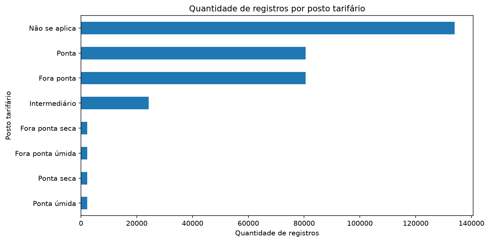

**TE mediana por modalidade e posto horário**

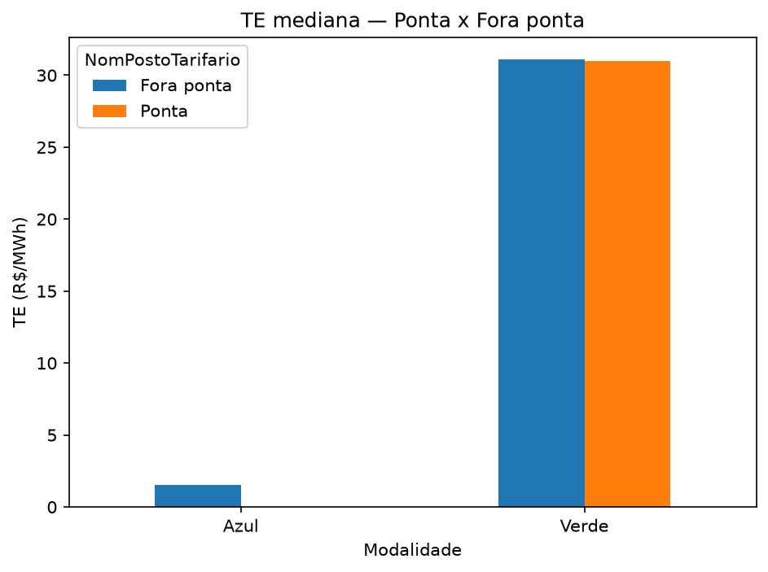

**Maiores diferenciais de TE entre Ponta e Fora ponta**

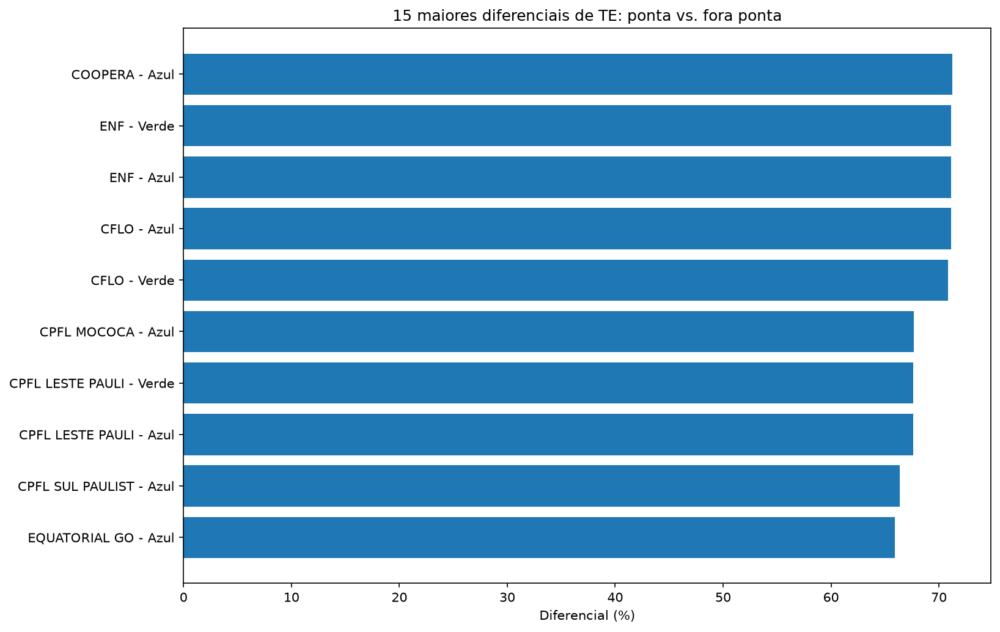

**TE por posto sazonal**

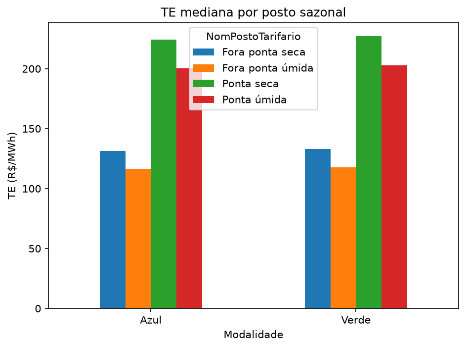

**Evolução do diferencial de TE**

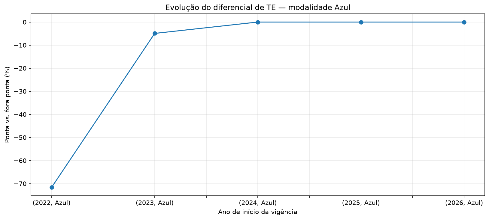

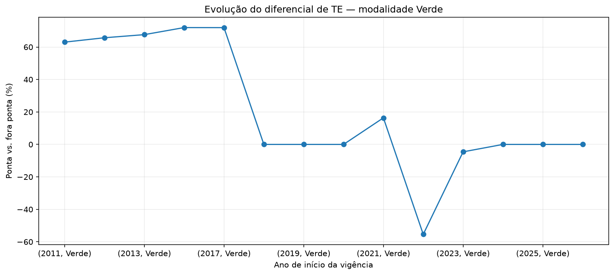

**Maiores diferenciais medianos nas tarifas vigentes**

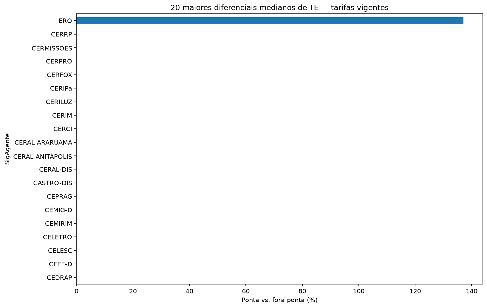

## Parte 2 — custo horossazonal em São Paulo

O segundo bloco estima o custo de energia por kWh para as distribuidoras paulistas. Como o CSV não informa a UF, o notebook mantém uma lista manual e editável de distribuidoras associadas a São Paulo, incluindo concessionárias e cooperativas. O recorte reuniu **60.738 registros** da base.

Para a tarifa de energia em R$/kWh, o notebook soma apenas parcelas em R$/MWh e divide por 1.000:

```text
Tarifa de energia (R$/kWh) = (TUSD (R$/MWh) + TE (R$/MWh)) / 1.000
```

O filtro principal mantém tarifas de aplicação, modalidades Azul e Verde e registros padrão, excluindo categorias especiais como APE, SCEE e tarifas associadas a acessantes nominais. Foram calculadas **51 combinações de distribuidora, modalidade e subgrupo**.

### Resultados para o subgrupo A4

Faixas indicadas no notebook para tarifas vigentes em **06/10/2026**, de concessionárias, sem tributos:

| Modalidade | Posto | Faixa (R$/kWh) | Menor valor | Maior valor |
|---|---|---:|---|---|
| Azul | Fora ponta | 0,395–0,483 | CPFL Santa Cruz | Elektro |
| Azul | Ponta | 0,535–0,669 | CPFL Santa Cruz | Elektro |
| Verde | Fora ponta | 0,395–0,483 | CPFL Santa Cruz | Elektro |
| Verde | Ponta | 1,405–2,204 | Enel SP | Elektro / CPFL Santa Cruz |

Na modalidade Azul, a ponta fica cerca de **1,35 a 1,42 vez** o valor fora ponta na parcela de energia. Na Verde, essa razão fica entre **3,1 e 5,6 vezes**, pois a tarifa de ponta em R$/MWh incorpora uma parcela associada à demanda de ponta. A TUSD de demanda em R$/kW é apresentada separadamente e não equivale, por si só, a um custo por kWh.

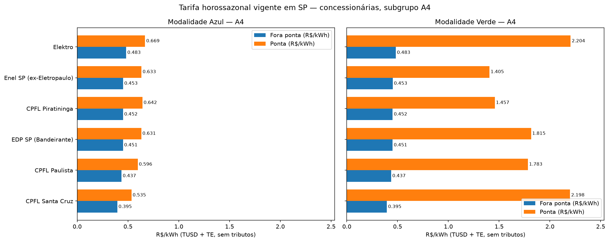

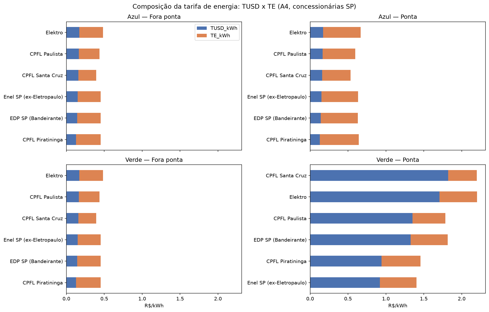

### Simulação de custo efetivo

Para comparar Azul e Verde, o notebook estima o custo de energia ponderado pelo consumo em cada posto e acrescenta a demanda convertida conforme o fator de carga. As premissas padrão são **fator de carga de 60%**, **10% do consumo na ponta** e **730 horas por mês**. São parâmetros ilustrativos e editáveis; não representam um perfil real de consumidor.

Com essas premissas, a conclusão registrada no notebook é de custos efetivos próximos entre as modalidades, com diferença estimada de **R$ 0,005 a R$ 0,010/kWh** a favor da Azul. Na sensibilidade para CPFL Paulista, a Verde fica mais barata a 5% de consumo na ponta; em torno de 10% ou acima, a Azul tende a compensar. A escolha depende do perfil efetivo de carga e das condições contratuais.

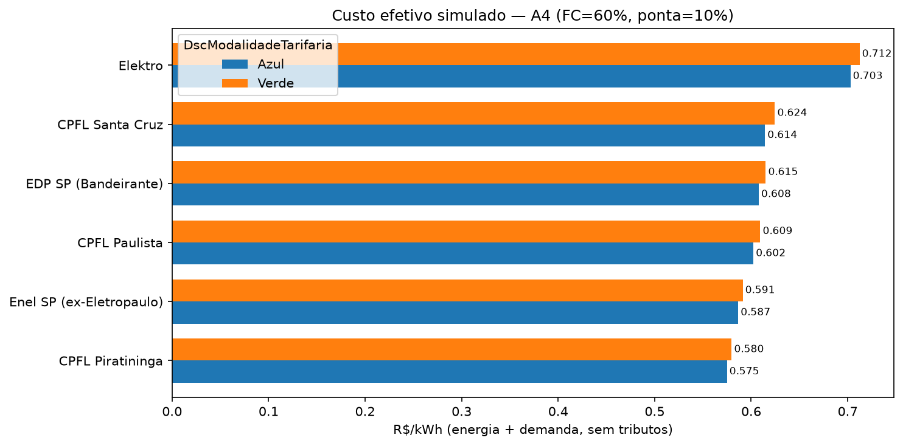

### Histórico e sazonalidade em São Paulo

A série histórica de tarifas em R$/kWh para A4 começa em 2015, pois até abril de 2014 a TE aparece nos postos sazonais e somá-la aos postos Ponta/Fora ponta daquele período subestimaria o valor. Para cada ano, usa-se a última vigência iniciada naquele ano. A conclusão do notebook aponta, para Azul/A4, altas acumuladas entre 2015 e 2026 de **22% a 49% fora ponta** e **18% a 45% na ponta**, conforme a distribuidora.

Os registros sazonais identificados para São Paulo abrangem **03/02/2010 a 14/04/2014**. O notebook calcula a comparação seco/úmido para as distribuidoras e subgrupos que possuem esses registros.

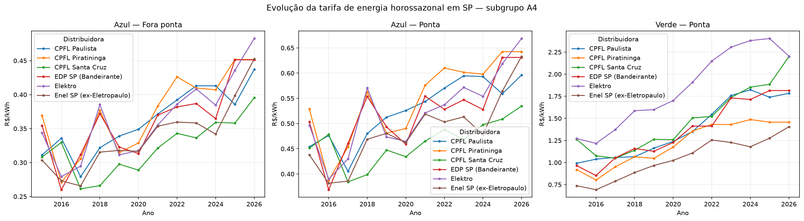

Ao executar a célula de exportação do notebook, a tabela consolidada é gravada como `tarifa_horossazonal_sp_vigente_kwh.csv`, na raiz do projeto, com separador `;` e decimal `,`.

## Limitações e cuidados de interpretação

- O CSV não informa a UF; a classificação de distribuidoras paulistas é manual e deve ser conferida, sobretudo para cooperativas e agentes históricos.
- As tarifas apresentadas não incluem ICMS, PIS/COFINS nem bandeiras tarifárias; portanto, não são necessariamente o valor final da fatura.
- TUSD em R$/kW é tarifa de demanda. Sua conversão para custo por kWh depende de premissas de consumo/fator de carga.
- As tarifas especiais excluídas pelo filtro não estão representadas no resultado principal.
- Os nomes dos postos não definem os horários de relógio. Para identificar os intervalos exatos de ponta, consulte a resolução tarifária aplicável à distribuidora.
- A análise é descritiva e não atribui causalidade às variações observadas.

## Referências

- [ANEEL — Tarifas homologadas das distribuidoras de energia elétrica](https://dadosabertos.aneel.gov.br/dataset/tarifas-distribuidoras-energia-eletrica)
- Dicionário de dados fornecido junto ao projeto, na pasta [`Dicionario`](Dicionario/).
